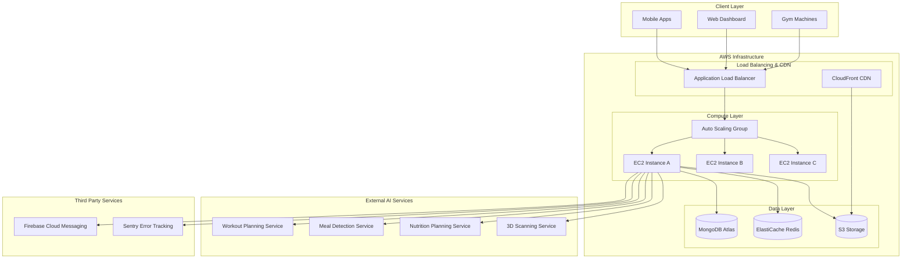
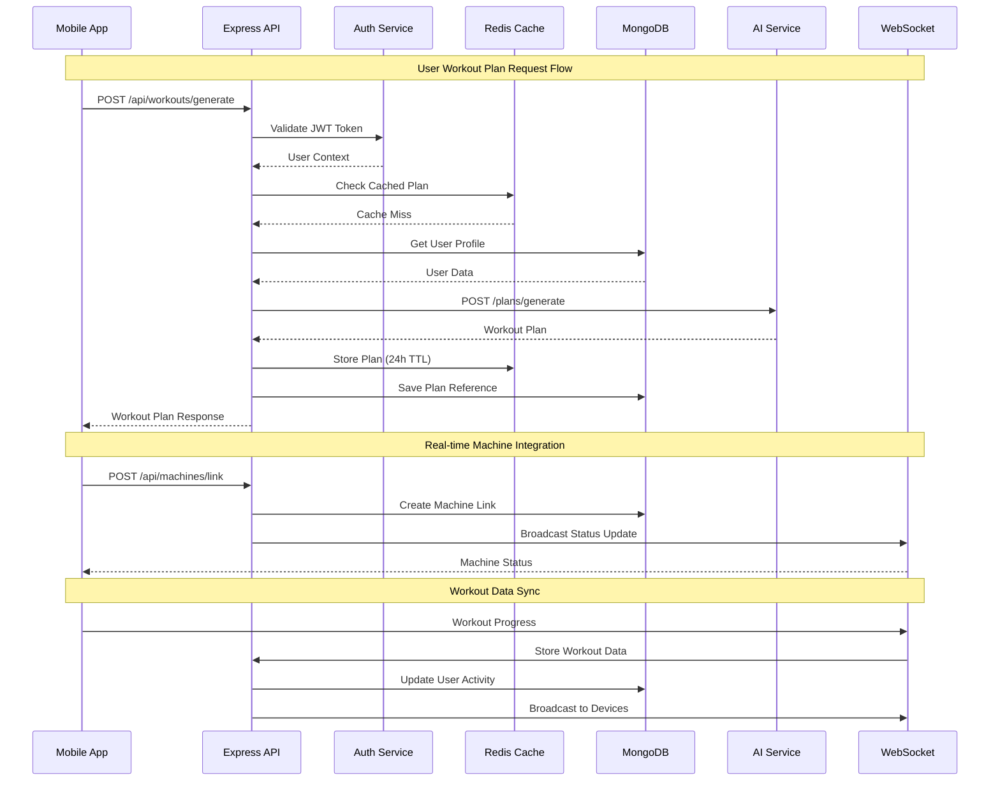

# NXG Connect Fitness App Architecture Document

## Introduction

This document outlines the complete system architecture for the NXG Connect Fitness App backend API server. The primary goal is to serve as the guiding architectural blueprint for building a high-performance, scalable Express.js/Node.js backend that orchestrates external AI services, manages real-time gym equipment integration, and provides comprehensive fitness tracking capabilities.

**Relationship to External Services:**
This architecture focuses on creating a robust API orchestration layer that integrates with specialized external AI services through direct HTTP calls while maintaining high performance, security, and reliability for the fitness ecosystem.

### Starter Template or Existing Project
N/A - Greenfield Express.js/Node.js backend project built from scratch with modern TypeScript tooling and best practices.

### Change Log

| Date | Version | Description | Author |
|------|---------|-------------|--------|
| 2025-01-19 | 1.0 | Initial architecture document | Winston (Architect) |

## High Level Architecture

### Technical Summary
The NXG Connect Fitness App backend employs a modern API-first monolithic architecture built with Express.js and TypeScript. The system orchestrates external AI services through direct HTTP calls while maintaining high-performance data management with MongoDB and Redis. Real-time capabilities are provided through Socket.IO for gym equipment integration, and the entire stack is designed for horizontal scaling on AWS with comprehensive security, monitoring, and error handling.

### Platform and Infrastructure Choice
**Platform:** AWS (Amazon Web Services)
**Key Services:** EC2 (compute), Application Load Balancer (traffic distribution), Auto Scaling Groups (scaling), S3 (file storage), CloudFront (CDN), RDS/MongoDB Atlas (database), ElastiCache Redis (caching)
**Deployment Host and Regions:** Primary deployment in AWS us-east-1 with backup capabilities in us-west-2 for disaster recovery

### Repository Structure
**Structure:** Monorepo with modular organization
**Monorepo Tool:** npm workspaces for dependency management
**Package Organization:** Single backend package with clear module separation for routes, services, middleware, and utilities

### High Level Architecture Diagram



### Architectural Patterns
- **API-First Architecture:** RESTful API design with comprehensive OpenAPI documentation and consistent response formats - _Rationale:_ Enables multiple client types and clear service contracts
- **Service Orchestration Pattern:** Backend coordinates external AI services through direct HTTP calls with circuit breaker protection - _Rationale:_ Simplifies integration while maintaining reliability and performance
- **CQRS Pattern:** Separate read and write operations for analytics and real-time data - _Rationale:_ Optimizes performance for high-frequency machine data vs user queries
- **Event-Driven Communication:** WebSocket events for real-time machine status and workout updates - _Rationale:_ Enables live fitness tracking and equipment availability
- **Repository Pattern:** Abstract data access layer for MongoDB operations - _Rationale:_ Enables testing and potential database migration flexibility
- **Circuit Breaker Pattern:** Protect against external service failures with fallback mechanisms - _Rationale:_ Maintains system stability when AI services are unavailable

## Tech Stack

This is the DEFINITIVE technology selection for the entire project. All development must use these exact versions.

### Technology Stack Table

| Category | Technology | Version | Purpose | Rationale |
|----------|------------|---------|---------|-----------|
| **Runtime** | Node.js | 20.11.0 | JavaScript runtime environment | LTS version with optimal performance and security |
| **Language** | TypeScript | 5.3.3 | Primary development language | Type safety, excellent tooling, enhanced developer experience |
| **Framework** | Express.js | 4.18.2 | Web application framework | Mature, performant, extensive middleware ecosystem |
| **Database** | MongoDB | 7.0 | Primary document database | Flexible schema for fitness data, excellent performance |
| **ODM** | Mongoose | 8.0.3 | MongoDB object modeling | Schema validation, middleware, and query building |
| **Cache** | Redis | 7.2 | In-memory caching and sessions | High-performance caching and real-time data |
| **WebSocket** | Socket.IO | 4.7.4 | Real-time communication | Machine connectivity and live updates |
| **Authentication** | jsonwebtoken | 9.0.2 | JWT token management | Stateless authentication for scalability |
| **Validation** | Joi | 17.11.0 | Input validation and sanitization | Comprehensive schema validation |
| **Password Hashing** | bcrypt | 5.1.1 | Secure password hashing | Industry standard for password security |
| **HTTP Client** | axios | 1.6.2 | External service integration | Reliable HTTP client with interceptors |
| **Rate Limiting** | express-rate-limit | 7.1.5 | API rate limiting | DDoS protection and abuse prevention |
| **Security** | helmet | 7.1.0 | Security headers middleware | Comprehensive security header management |
| **Logging** | winston | 3.11.0 | Structured logging | Production-grade logging with multiple transports |
| **Error Tracking** | @sentry/node | 7.81.1 | Error monitoring and tracking | Real-time error tracking and performance monitoring |
| **Testing Framework** | Jest | 29.7.0 | Unit and integration testing | Comprehensive testing with mocking capabilities |
| **API Testing** | supertest | 6.3.3 | HTTP endpoint testing | Integration testing for REST APIs |
| **Load Testing** | artillery | 2.0.3 | Performance and load testing | Scalability validation and performance benchmarking |
| **Documentation** | swagger-jsdoc | 6.2.8 | API documentation generation | Auto-generated OpenAPI specifications |
| **Environment** | dotenv | 16.3.1 | Environment configuration | Secure configuration management |
| **Process Manager** | PM2 | 5.3.0 | Production process management | Process clustering and zero-downtime deployments |
| **File Upload** | multer | 1.4.5 | Multipart form handling | Meal image and scan file uploads |
| **Image Processing** | sharp | 0.33.0 | Image optimization | Meal image compression and format conversion |
| **Push Notifications** | firebase-admin | 11.11.1 | Firebase Cloud Messaging | Cross-platform push notifications |
| **Cloud SDK** | aws-sdk | 2.1490.0 | AWS service integration | S3 storage and CloudFront CDN |

## Data Models

### User

**Purpose:** Core user entity managing authentication, profile, and fitness data

**Key Attributes:**
- _id: ObjectId - Unique user identifier
- username: String - Unique username for login
- email: String - User email address and login credential
- passwordHash: String - Bcrypt hashed password
- profile: Object - Demographic and fitness profile data
- bodyComposition: Object - Body metrics and health data
- activePlans: Object - References to current workout and diet plans

**Relationships:**
- Has many: WorkoutSessions, UserActivity, 3DScans
- Belongs to: Branch (gym location)

```typescript
interface User {
  _id: ObjectId;
  username: string;
  email: string;
  passwordHash: string;
  profile: {
    name: string;
    demographics: Demographics;
    fitnessProfile: FitnessProfile;
    dietPreferences: DietPreferences;
  };
  bodyComposition: BodyComposition;
  activePlans: {
    workoutPlanId?: ObjectId;
    dietPlanId?: ObjectId;
  };
  branches: BranchAssociation[];
  totalPoints: number;
  isActive: boolean;
  createdAt: Date;
  updatedAt: Date;
}
```

### WorkoutPlan

**Purpose:** Cached workout plans from external AI service with local customizations

**Key Attributes:**
- _id: ObjectId - Unique plan identifier
- userId: ObjectId - Reference to user
- planData: Object - Cached plan from external service
- isActive: Boolean - Current active plan status
- customizations: Object - Local user modifications

**Relationships:**
- Belongs to: User
- Has many: WorkoutSessions

### UserActivity

**Purpose:** Time-series data for daily user activities and progress tracking

**Key Attributes:**
- _id: ObjectId - Unique activity record identifier
- userId: ObjectId - Reference to user
- date: Date - Activity date
- workoutActivity: Object - Workout completion and performance data
- dietActivity: Object - Meal logging and nutrition compliance
- pointsEarned: Array - Points awarded for activities

**Relationships:**
- Belongs to: User
- References: Exercises, Machines

### Machine

**Purpose:** Gym equipment entity for real-time availability and workout tracking

**Key Attributes:**
- _id: ObjectId - Unique machine identifier
- branchId: ObjectId - Reference to gym branch
- name: String - Machine name and identifier
- type: String - Equipment category (cardio, strength, functional)
- status: String - Current availability status
- currentUserId: ObjectId - Currently linked user

**Relationships:**
- Belongs to: Branch
- Has many: WorkoutSessions, MachineActivity

## Components

### Authentication Service

**Responsibility:** Handle user authentication, JWT token management, and session security

**Key Interfaces:**
- POST /api/auth/register - User registration with validation
- POST /api/auth/login - User authentication and token generation
- POST /api/auth/refresh - Refresh token validation and renewal
- POST /api/auth/logout - Token invalidation and session cleanup

**Dependencies:** MongoDB (user storage), Redis (token blacklist), bcrypt (password hashing)

**Technology Stack:** Express.js middleware, jsonwebtoken, bcrypt, Redis client

### External Service Integration Layer

**Responsibility:** Orchestrate direct HTTP calls to external AI services with error handling and caching

**Key Interfaces:**
- External workout planning service integration
- External meal detection service integration  
- External nutrition planning service integration
- External 3D scanning service integration

**Dependencies:** axios (HTTP client), Redis (response caching), Circuit breaker implementation

**Technology Stack:** axios interceptors, Redis caching, Winston logging, Sentry error tracking

### Real-time Communication Service

**Responsibility:** Manage WebSocket connections for gym equipment and live data synchronization

**Key Interfaces:**
- WebSocket /api/ws/machines - Machine status updates
- WebSocket /api/ws/workouts - Live workout progress
- Machine heartbeat endpoints
- Real-time availability broadcasting

**Dependencies:** Socket.IO server, Redis (connection state), JWT authentication

**Technology Stack:** Socket.IO, Redis adapter for clustering, JWT middleware

### Analytics Engine

**Responsibility:** Calculate performance metrics, progress tracking, and goal achievement analytics

**Key Interfaces:**
- GET /api/analytics/workout/* - Workout progress calculations
- GET /api/analytics/nutrition/* - Nutrition compliance analytics
- GET /api/analytics/body/* - Body composition trend analysis
- Background aggregation jobs

**Dependencies:** MongoDB aggregation pipelines, Redis (cached results), User activity data

**Technology Stack:** MongoDB aggregation framework, Node.js scheduled jobs, Redis caching

### Notification Service

**Responsibility:** Manage push notifications, scheduling, and engagement tracking

**Key Interfaces:**
- POST /api/notifications/register - Device token management
- Scheduled notification delivery
- Achievement unlock notifications
- Social interaction notifications

**Dependencies:** Firebase Cloud Messaging, MongoDB (user preferences), Redis (scheduling)

**Technology Stack:** Firebase Admin SDK, Node.js cron jobs, Redis task queues

### File Management Service

**Responsibility:** Handle file uploads, image processing, and S3 storage integration

**Key Interfaces:**
- POST /api/upload/meal-images - Meal photo processing
- POST /api/upload/scan-data - InBody scan file handling
- Avatar file storage and retrieval
- CDN integration for optimized delivery

**Dependencies:** AWS S3, CloudFront CDN, Sharp (image processing), multer (file uploads)

**Technology Stack:** AWS SDK, multer middleware, Sharp image processing, S3 client

## External APIs

### Workout Planning Service API

- **Purpose:** Retrieve personalized workout plans based on user profile and goals
- **Documentation:** [External service documentation URL]
- **Base URL:** https://api.workout-service.com/v1
- **Authentication:** API Key authentication via headers
- **Rate Limits:** 1000 requests per hour per API key

**Key Endpoints Used:**
- `POST /plans/generate` - Generate personalized workout plan
- `GET /exercises/library` - Retrieve exercise database
- `POST /plans/customize` - Modify existing workout plans

**Integration Notes:** Implement retry logic with exponential backoff, cache responses for 24 hours, fallback to cached plans on service unavailability

### Meal Detection Service API

- **Purpose:** Analyze meal images and extract nutrition information
- **Documentation:** [External service documentation URL]
- **Base URL:** https://api.meal-detection.com/v1
- **Authentication:** Bearer token authentication
- **Rate Limits:** 500 requests per hour per token

**Key Endpoints Used:**
- `POST /analyze/image` - Analyze meal photo and extract nutrition data
- `GET /confidence/score` - Retrieve confidence scoring for detection
- `POST /correction/feedback` - Submit user corrections for model improvement

**Integration Notes:** Handle low-confidence results with user verification prompts, implement image compression before sending, cache results by image hash

### Nutrition Planning Service API

- **Purpose:** Generate personalized meal plans based on dietary preferences and macro targets
- **Documentation:** [External service documentation URL]
- **Base URL:** https://api.nutrition-planner.com/v1
- **Authentication:** API Key with HMAC signature
- **Rate Limits:** 2000 requests per day per API key

**Key Endpoints Used:**
- `POST /plans/generate` - Create personalized meal plans
- `GET /foods/database` - Access comprehensive food database
- `POST /macros/calculate` - Calculate optimal macro distribution

**Integration Notes:** Refresh meal plans weekly or on goal changes, cache food database locally for performance, implement request signing for security

### 3D Scanning Service API

- **Purpose:** Process InBody scan data and generate 3D avatars
- **Documentation:** [External service documentation URL]
- **Base URL:** https://api.3d-scanning.com/v1
- **Authentication:** OAuth 2.0 with client credentials
- **Rate Limits:** 100 scan processing requests per hour

**Key Endpoints Used:**
- `POST /scans/process` - Process InBody scan data
- `POST /avatars/generate` - Generate 3D avatar from measurements
- `GET /processing/status` - Check scan processing status

**Integration Notes:** Implement asynchronous processing with webhooks, store avatar files in S3, handle large file uploads with multipart uploads

## Core Workflows



## Database Schema

```sql
-- MongoDB Collections Schema Design

// Users Collection
{
  "_id": ObjectId,
  "username": String, // indexed, unique
  "email": String, // indexed, unique  
  "passwordHash": String,
  "profile": {
    "name": String,
    "demographics": {
      "age": Number,
      "heightCm": Number,
      "weightKg": Number,
      "gender": String,
      "activityLevel": String
    },
    "fitnessProfile": {
      "level": String,
      "goal": String,
      "healthConditions": [String]
    },
    "dietPreferences": {
      "cuisinePreferences": Object,
      "allergies": [String]
    }
  },
  "bodyComposition": {
    "bodyFatPercentage": Number,
    "skeletalMuscleMassKg": Number,
    "basalMetabolicRateKcal": Number,
    // ... other body metrics
  },
  "activePlans": {
    "workoutPlanId": ObjectId,
    "dietPlanId": ObjectId
  },
  "branches": [{
    "branchId": ObjectId,
    "branchName": String,
    "joinedAt": Date
  }],
  "totalPoints": Number,
  "isActive": Boolean,
  "createdAt": Date,
  "updatedAt": Date
}

// Workout Plans Collection
{
  "_id": ObjectId,
  "userId": ObjectId, // indexed
  "planName": String,
  "externalServiceId": String,
  "planData": {
    "workoutDays": [{
      "muscleGroup": String,
      "dayOrder": Number,
      "exercises": [{
        "exerciseId": ObjectId,
        "exerciseName": String,
        "sets": Number,
        "reps": Number,
        "seconds": Number
      }]
    }]
  },
  "customizations": Object,
  "isActive": Boolean,
  "cacheExpiry": Date,
  "createdAt": Date,
  "updatedAt": Date
}

// User Activity Collection (Time-series)
{
  "_id": ObjectId,
  "userId": ObjectId, // indexed
  "date": Date, // indexed
  "workoutActivity": {
    "assignedWorkouts": Number,
    "completedWorkouts": Number,
    "completionPercentage": Number,
    "workoutHistory": [{
      "exerciseId": ObjectId,
      "exerciseName": String,
      "completedSets": Number,
      "completedReps": Number,
      "performanceNotes": String,
      "completedAt": Date
    }]
  },
  "dietActivity": {
    "scheduledMeals": Number,
    "completedMeals": Number,
    "mealHistory": [{
      "mealType": String,
      "mealDescription": String,
      "consumedAt": Date,
      "macros": {
        "calories": Number,
        "carbs": Number,
        "protein": Number,
        "fat": Number
      }
    }]
  },
  "pointsEarned": [{
    "points": Number,
    "reason": String,
    "awardedAt": Date
  }]
}

// Machines Collection
{
  "_id": ObjectId,
  "branchId": ObjectId, // indexed
  "name": String,
  "type": String, // cardio, strength, functional
  "status": String, // available, occupied, maintenance
  "currentUserId": ObjectId,
  "qrCode": String, // indexed
  "location": String,
  "lastHeartbeat": Date,
  "maintenanceLog": [{
    "date": Date,
    "type": String,
    "notes": String
  }],
  "createdAt": Date,
  "updatedAt": Date
}

// Gym Sessions Collection
{
  "_id": ObjectId,
  "userId": ObjectId, // indexed
  "branchId": ObjectId,
  "startTime": Date,
  "endTime": Date,
  "duration": Number, // minutes
  "machinesUsed": [ObjectId],
  "status": String, // active, completed, expired
  "createdAt": Date
}
```

## Source Tree

```plaintext
nxg-fitness-backend/
├── src/
│   ├── controllers/                # HTTP request handlers
│   │   ├── auth.controller.ts      # Authentication endpoints
│   │   ├── users.controller.ts     # User management endpoints
│   │   ├── sessions.controller.ts  # Gym session management
│   │   ├── machines.controller.ts  # Machine integration endpoints
│   │   ├── workouts.controller.ts  # Workout management endpoints
│   │   ├── nutrition.controller.ts # Nutrition tracking endpoints
│   │   ├── analytics.controller.ts # Analytics and progress endpoints
│   │   ├── social.controller.ts    # Social features endpoints
│   │   └── notifications.controller.ts # Notification management
│   ├── services/                   # Business logic layer
│   │   ├── auth.service.ts         # Authentication business logic
│   │   ├── users.service.ts        # User management service
│   │   ├── external/               # External service integration
│   │   │   ├── workout-planning.service.ts
│   │   │   ├── meal-detection.service.ts
│   │   │   ├── nutrition-planning.service.ts
│   │   │   └── scanning.service.ts
│   │   ├── analytics.service.ts    # Analytics calculations
│   │   ├── notifications.service.ts # Push notification service
│   │   ├── websocket.service.ts    # Real-time communication
│   │   └── file-storage.service.ts # S3 file management
│   ├── models/                     # Mongoose data models
│   │   ├── User.ts                 # User schema and model
│   │   ├── WorkoutPlan.ts          # Workout plan schema
│   │   ├── UserActivity.ts         # Activity tracking schema
│   │   ├── Machine.ts              # Gym equipment schema
│   │   ├── Session.ts              # Gym session schema
│   │   └── index.ts                # Model exports
│   ├── middleware/                 # Express middleware
│   │   ├── auth.middleware.ts      # JWT authentication
│   │   ├── validation.middleware.ts # Joi input validation
│   │   ├── rateLimit.middleware.ts # Rate limiting
│   │   ├── error.middleware.ts     # Error handling
│   │   └── logging.middleware.ts   # Request logging
│   ├── routes/                     # Express route definitions
│   │   ├── auth.routes.ts          # Authentication routes
│   │   ├── users.routes.ts         # User management routes
│   │   ├── sessions.routes.ts      # Session management routes
│   │   ├── machines.routes.ts      # Machine integration routes
│   │   ├── workouts.routes.ts      # Workout routes
│   │   ├── nutrition.routes.ts     # Nutrition routes
│   │   ├── analytics.routes.ts     # Analytics routes
│   │   ├── social.routes.ts        # Social features routes
│   │   └── index.ts                # Route aggregation
│   ├── utils/                      # Utility functions
│   │   ├── database.ts             # MongoDB connection
│   │   ├── redis.ts                # Redis connection
│   │   ├── logger.ts               # Winston configuration
│   │   ├── validation.ts           # Joi schemas
│   │   ├── jwt.ts                  # JWT utilities
│   │   ├── encryption.ts           # Encryption utilities
│   │   ├── file-upload.ts          # Multer configuration
│   │   └── constants.ts            # Application constants
│   ├── config/                     # Configuration management
│   │   ├── database.config.ts      # Database configuration
│   │   ├── redis.config.ts         # Redis configuration
│   │   ├── aws.config.ts           # AWS SDK configuration
│   │   ├── external-apis.config.ts # External service configs
│   │   └── environment.ts          # Environment variables
│   ├── websocket/                  # WebSocket implementation
│   │   ├── machine.socket.ts       # Machine connectivity handlers
│   │   ├── workout.socket.ts       # Workout progress handlers
│   │   ├── auth.socket.ts          # WebSocket authentication
│   │   └── index.ts                # Socket.IO server setup
│   ├── jobs/                       # Background job processing
│   │   ├── session-cleanup.job.ts  # Auto-end gym sessions
│   │   ├── analytics.job.ts        # Scheduled analytics
│   │   ├── notifications.job.ts    # Scheduled notifications
│   │   └── cache-refresh.job.ts    # Cache maintenance
│   └── app.ts                      # Express application setup
├── tests/                          # Test suites
│   ├── unit/                       # Unit tests
│   │   ├── services/               # Service layer tests
│   │   ├── models/                 # Model tests
│   │   └── utils/                  # Utility tests
│   ├── integration/                # Integration tests
│   │   ├── api/                    # API endpoint tests
│   │   ├── database/               # Database tests
│   │   └── external/               # External service tests
│   ├── fixtures/                   # Test data
│   └── setup.ts                    # Test configuration
├── docs/                           # Documentation
│   ├── api/                        # API documentation
│   │   ├── openapi.yaml            # OpenAPI specification
│   │   └── postman-collection.json # Postman collection
│   ├── deployment/                 # Deployment guides
│   └── architecture.md             # This document
├── scripts/                        # Deployment and utility scripts
│   ├── deploy.sh                   # Deployment script
│   ├── migrate.js                  # Database migration
│   └── seed.js                     # Development data seeding
├── .env.example                    # Environment template
├── .gitignore                      # Git ignore rules
├── package.json                    # Dependencies and scripts
├── tsconfig.json                   # TypeScript configuration
├── jest.config.js                  # Jest testing configuration
├── ecosystem.config.js             # PM2 configuration
└── README.md                       # Project documentation
```

## Infrastructure and Deployment

### Infrastructure as Code
- **Tool:** AWS CloudFormation with CDK (TypeScript)
- **Location:** `infrastructure/` directory
- **Approach:** Code-first infrastructure with version control and automated deployment

### Deployment Strategy
- **Strategy:** Blue/Green deployment with health checks
- **CI/CD Platform:** AWS CodePipeline with CodeBuild and CodeDeploy
- **Pipeline Configuration:** `.aws/buildspec.yml` and deployment scripts

### Environments

- **Development:** Local development with Docker containers for MongoDB and Redis
- **Staging:** Single EC2 instance with shared MongoDB Atlas cluster for testing
- **Production:** Auto Scaling Group with multiple EC2 instances and dedicated MongoDB Atlas cluster

### Environment Promotion Flow
```text
Development (Local) → Staging (AWS) → Production (AWS)
- Automated testing at each stage
- Manual approval required for production deployment
- Rollback capability at each stage
```

### Rollback Strategy
- **Primary Method:** AWS CodeDeploy automatic rollback on health check failure
- **Trigger Conditions:** HTTP 5xx errors > 5% or application health check failure
- **Recovery Time Objective:** < 5 minutes for automated rollback

## Error Handling Strategy

### General Approach
- **Error Model:** Structured error responses with consistent format across all endpoints
- **Exception Hierarchy:** Custom error classes extending base Error with specific error types
- **Error Propagation:** Centralized error handling middleware with proper HTTP status codes

### Logging Standards
- **Library:** Winston 3.11.0 with multiple transports
- **Format:** JSON structured logging with correlation IDs for request tracking
- **Levels:** error, warn, info, debug with production filtering
- **Required Context:**
  - Correlation ID: UUID v4 format for request tracing
  - Service Context: service name, version, environment
  - User Context: user ID (when authenticated), IP address, user agent

### Error Handling Patterns

#### External API Errors
- **Retry Policy:** Exponential backoff with jitter, max 3 retries
- **Circuit Breaker:** 50% failure rate threshold, 30-second reset timeout
- **Timeout Configuration:** 10 seconds for AI services, 5 seconds for other APIs
- **Error Translation:** Map external service errors to standardized internal error codes

#### Business Logic Errors
- **Custom Exceptions:** ValidationError, AuthenticationError, AuthorizationError, NotFoundError
- **User-Facing Errors:** Sanitized error messages without internal details
- **Error Codes:** Standardized error codes for client application handling

#### Data Consistency
- **Transaction Strategy:** MongoDB transactions for multi-document operations
- **Compensation Logic:** Retry mechanisms for failed external service calls
- **Idempotency:** Request deduplication using Redis for critical operations

## Coding Standards

### Core Standards
- **Languages & Runtimes:** TypeScript 5.3.3, Node.js 20.11.0 LTS
- **Style & Linting:** ESLint with TypeScript rules, Prettier for formatting
- **Test Organization:** Jest tests co-located with source files, supertest for API tests

### Critical Rules
- **Async/Await Only:** Never use callbacks or raw Promises - always use async/await for better error handling
- **Input Validation Required:** All API endpoints must use Joi validation schemas before processing
- **Error Logging Mandatory:** All catch blocks must log errors with context using Winston logger
- **JWT Validation:** Protected routes must use auth middleware - never bypass authentication
- **External Service Timeouts:** All external HTTP calls must have explicit timeouts and error handling
- **Database Transactions:** Multi-document operations must use MongoDB transactions for consistency
- **Redis Key Prefixes:** All Redis keys must use consistent prefixes (auth:, cache:, session:) for organization
- **TypeScript Strict Mode:** All files must compile with strict TypeScript settings - no any types allowed

## Test Strategy and Standards

### Testing Philosophy
- **Approach:** Test-driven development (TDD) for critical business logic
- **Coverage Goals:** 80% minimum code coverage for services and controllers
- **Test Pyramid:** 70% unit tests, 20% integration tests, 10% end-to-end tests

### Test Types and Organization

#### Unit Tests
- **Framework:** Jest 29.7.0 with TypeScript support
- **File Convention:** `*.test.ts` co-located with source files
- **Location:** Adjacent to source files for better discoverability
- **Mocking Library:** Jest built-in mocking with manual mocks for external services
- **Coverage Requirement:** 85% minimum for service layer, 75% for controllers

**AI Agent Requirements:**
- Generate tests for all public methods and API endpoints
- Cover edge cases and error conditions with specific test scenarios
- Follow AAA pattern (Arrange, Act, Assert) for test structure
- Mock all external dependencies including databases and external APIs

#### Integration Tests
- **Scope:** API endpoint testing with real database connections
- **Location:** `tests/integration/` directory with organized test suites
- **Test Infrastructure:**
  - **MongoDB:** TestContainers with isolated test database
  - **Redis:** In-memory Redis instance for testing
  - **External APIs:** WireMock for stubbing external service responses

#### End-to-End Tests
- **Framework:** Supertest 6.3.3 for HTTP testing
- **Scope:** Critical user journeys and complete API workflows
- **Environment:** Dedicated testing environment with full service stack
- **Test Data:** Factory pattern for consistent test data generation

### Test Data Management
- **Strategy:** Factory functions for generating consistent test data
- **Fixtures:** JSON fixtures for complex test scenarios in `tests/fixtures/`
- **Factories:** TypeScript factory functions for model creation
- **Cleanup:** Automated test database cleanup between test runs

### Continuous Testing
- **CI Integration:** Automated testing on every pull request and merge
- **Performance Tests:** Artillery load testing in staging environment
- **Security Tests:** OWASP ZAP automated security scanning

## Security

### Input Validation
- **Validation Library:** Joi 17.11.0 with comprehensive schemas
- **Validation Location:** Middleware layer before business logic processing
- **Required Rules:**
  - All external inputs MUST be validated against defined schemas
  - Validation at API boundary before processing
  - Whitelist approach preferred over blacklist
  - File upload validation for size, type, and content

### Authentication & Authorization
- **Auth Method:** JWT with RSA256 signing algorithm
- **Session Management:** Stateless JWT with Redis blacklist for logout
- **Required Patterns:**
  - Bearer token authentication for all protected endpoints
  - Role-based access control (RBAC) for administrative functions
  - Refresh token rotation for enhanced security
  - Multi-factor authentication support for sensitive operations

### Secrets Management
- **Development:** dotenv with .env.local files (gitignored)
- **Production:** AWS Secrets Manager with automatic rotation
- **Code Requirements:**
  - NEVER hardcode secrets in source code
  - Access via configuration service only
  - No secrets in logs or error messages
  - Environment-specific secret rotation

### API Security
- **Rate Limiting:** express-rate-limit with Redis store (100 requests per 15 minutes per IP)
- **CORS Policy:** Strict origin validation with credentials support
- **Security Headers:** Helmet.js with CSP, HSTS, and XSS protection
- **HTTPS Enforcement:** TLS 1.3 minimum with HTTP redirect to HTTPS

### Data Protection
- **Encryption at Rest:** MongoDB encryption with customer-managed keys
- **Encryption in Transit:** TLS 1.3 for all API communications
- **PII Handling:** Field-level encryption for sensitive health data
- **Logging Restrictions:** No PII, passwords, or tokens in application logs

### Dependency Security
- **Scanning Tool:** npm audit with automated vulnerability scanning
- **Update Policy:** Monthly dependency updates with security patch priority
- **Approval Process:** Security review required for new critical dependencies

### Security Testing
- **SAST Tool:** ESLint security rules with custom security linting
- **DAST Tool:** OWASP ZAP automated scanning in CI/CD pipeline
- **Penetration Testing:** Quarterly third-party security assessment

## Checklist Results Report

*[This section will be populated after running the architect-checklist to validate the architecture]*

## Next Steps

After completing the architecture, proceed with implementation in this order:

1. **Infrastructure Setup**: Deploy AWS infrastructure using CloudFormation templates
2. **Core Backend Development**: Begin with Epic 1 (Core Infrastructure & Authentication)
3. **External Service Integration**: Implement integration layer for AI services
4. **Real-time Infrastructure**: Deploy WebSocket infrastructure for machine connectivity
5. **Testing & Validation**: Implement comprehensive testing strategy
6. **Production Deployment**: Deploy to production with monitoring and observability

### Story Manager Handoff

The architecture is complete and ready for development. Key implementation priorities:

1. **Start with Core Infrastructure**: Epic 1 provides the foundation - implement Express.js setup, MongoDB/Redis connections, and JWT authentication first
2. **External Service Integration**: Implement circuit breaker patterns and caching for AI service integration from the beginning
3. **Real-time Requirements**: WebSocket infrastructure is critical for machine connectivity - prioritize this early in Epic 3
4. **Security First**: Implement all security middleware and validation from day one - security cannot be retrofitted
5. **Testing Strategy**: Set up testing infrastructure early - aim for 80% coverage from the start

### Developer Handoff

Architecture is production-ready for implementation. Key technical decisions validated:

1. **Direct HTTP Integration**: Simple, reliable approach for external AI services with proper error handling
2. **MongoDB + Redis**: Optimal for fitness data with real-time caching requirements
3. **Socket.IO WebSockets**: Proven solution for gym equipment real-time communication
4. **AWS Infrastructure**: Scalable, secure platform with comprehensive service ecosystem
5. **TypeScript + Express.js**: Mature, type-safe backend stack with excellent ecosystem support

The architecture supports 1000+ concurrent users, sub-200ms response times, and 99.9% uptime requirements through proven patterns and technologies.