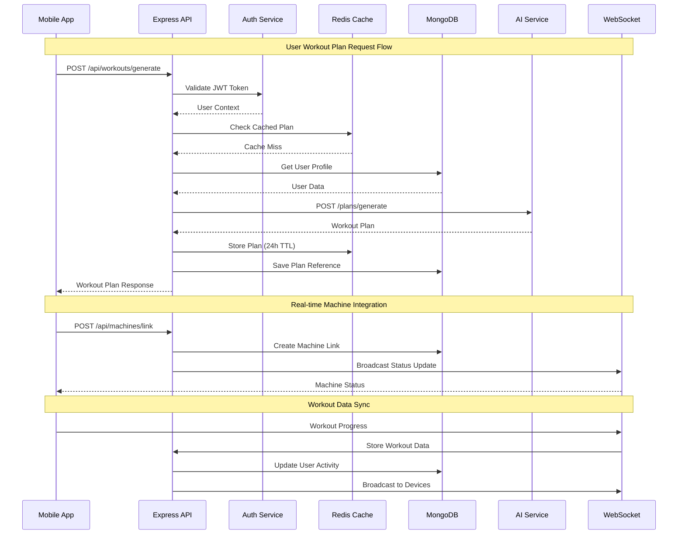

# Core Workflows

```mermaid
sequenceDiagram
    participant Client as Mobile App
    participant API as Express API
    participant Auth as Auth Service
    participant Cache as Redis Cache
    participant DB as MongoDB
    participant External as AI Service
    participant WS as WebSocket
    
    Note over Client,WS: User Workout Plan Request Flow
    
    Client->>API: POST /api/workouts/generate
    API->>Auth: Validate JWT Token
    Auth-->>API: User Context
    
    API->>Cache: Check Cached Plan
    Cache-->>API: Cache Miss
    
    API->>DB: Get User Profile
    DB-->>API: User Data
    
    API->>External: POST /plans/generate
    External-->>API: Workout Plan
    
    API->>Cache: Store Plan (24h TTL)
    API->>DB: Save Plan Reference
    
    API-->>Client: Workout Plan Response
    
    Note over Client,WS: Real-time Machine Integration
    
    Client->>API: POST /api/machines/link
    API->>DB: Create Machine Link
    API->>WS: Broadcast Status Update
    WS-->>Client: Machine Status
    
    Note over Client,WS: Workout Data Sync
    
    Client->>WS: Workout Progress
    WS->>API: Store Workout Data
    API->>DB: Update User Activity
    API->>WS: Broadcast to Devices
```
