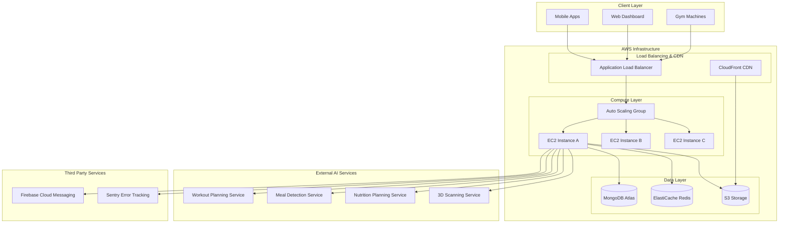

# High Level Architecture

## Technical Summary
The NXG Connect Fitness App backend employs a modern API-first monolithic architecture built with Express.js and TypeScript. The system orchestrates external AI services through direct HTTP calls while maintaining high-performance data management with MongoDB and Redis. Real-time capabilities are provided through Socket.IO for gym equipment integration, and the entire stack is designed for horizontal scaling on AWS with comprehensive security, monitoring, and error handling.

## Platform and Infrastructure Choice
**Platform:** AWS (Amazon Web Services)
**Key Services:** EC2 (compute), Application Load Balancer (traffic distribution), Auto Scaling Groups (scaling), S3 (file storage), CloudFront (CDN), RDS/MongoDB Atlas (database), ElastiCache Redis (caching)
**Deployment Host and Regions:** Primary deployment in AWS us-east-1 with backup capabilities in us-west-2 for disaster recovery

## Repository Structure
**Structure:** Monorepo with modular organization
**Monorepo Tool:** npm workspaces for dependency management
**Package Organization:** Single backend package with clear module separation for routes, services, middleware, and utilities

## High Level Architecture Diagram

## Architectural Patterns
- **API-First Architecture:** RESTful API design with comprehensive OpenAPI documentation and consistent response formats - _Rationale:_ Enables multiple client types and clear service contracts
- **Service Orchestration Pattern:** Backend coordinates external AI services through direct HTTP calls with circuit breaker protection - _Rationale:_ Simplifies integration while maintaining reliability and performance
- **CQRS Pattern:** Separate read and write operations for analytics and real-time data - _Rationale:_ Optimizes performance for high-frequency machine data vs user queries
- **Event-Driven Communication:** WebSocket events for real-time machine status and workout updates - _Rationale:_ Enables live fitness tracking and equipment availability
- **Repository Pattern:** Abstract data access layer for MongoDB operations - _Rationale:_ Enables testing and potential database migration flexibility
- **Circuit Breaker Pattern:** Protect against external service failures with fallback mechanisms - _Rationale:_ Maintains system stability when AI services are unavailable
